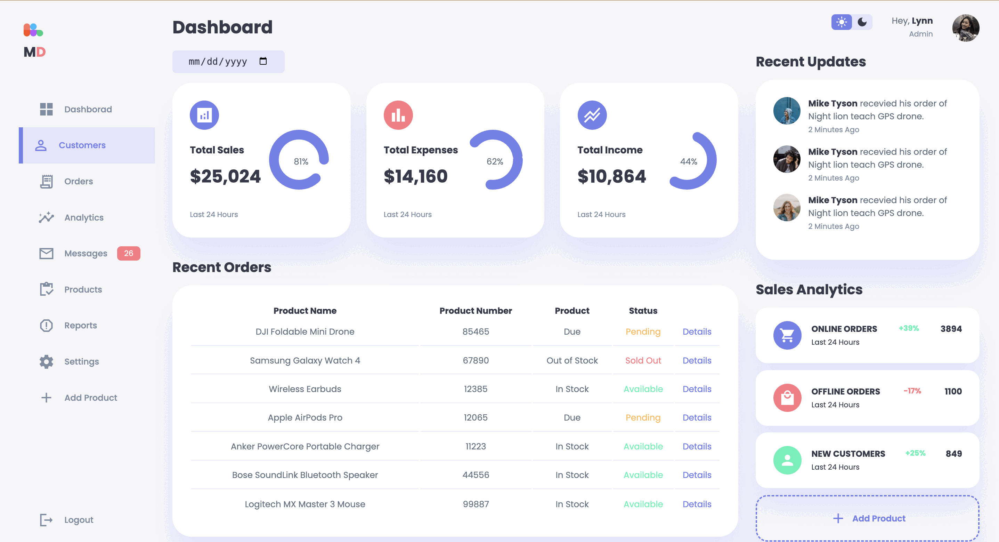

# E-commerce Data Visualization Dashboard

- Engineered a data visualization dashboard tailored for e-commerce users to enable real-time tracking of sales data.
- Utilized HTML, CSS, and JavaScript, enhanced with Bootstrap, for rapid development and design consistency.
- Designed the dashboard with dual themes: a bright mode for enhanced readability and a dark mode for reduced eye strain, both switchable seamlessly.
- Leveraged Bootstrap's grid system and pre-built components to achieve a responsive and modern UI.
- Incorporated JavaScript to add interactivity, including dynamic updates of sales data.
- Managed the project using Git, ensuring regular commits and updates for efficient version control.

Check My [DEMO](https://ychen463.github.io/webdev-responsive-dashboard/)!

