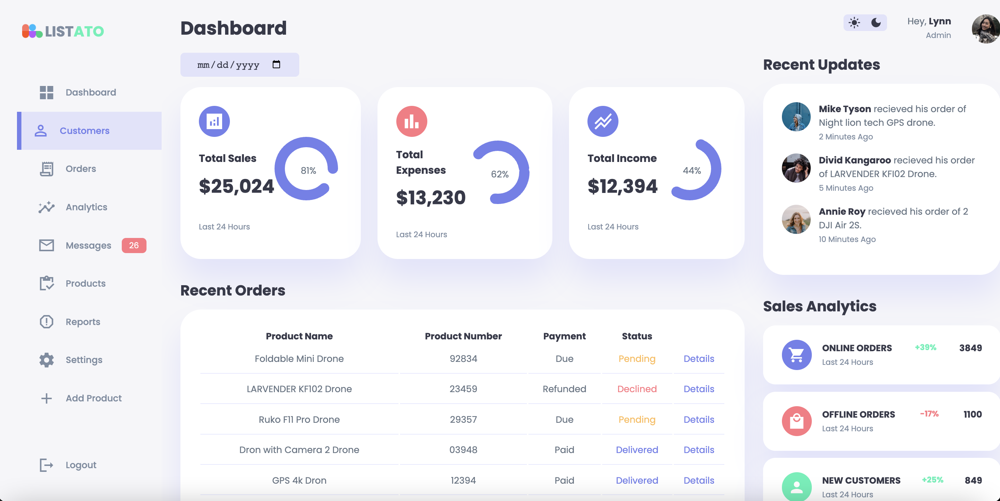

# E-commerce Data Visualization Dashboard

- Engineered a data visualization dashboard tailored for e-commerce users, enabling real-time tracking of sales data.
- Utilized a technology stack comprising 51.1% CSS, 38.9% HTML, and 10.0% JavaScript to create a robust and responsive UI.
- Designed the dashboard with dual themes: a bright mode for enhanced readability and a dark mode for reduced eye strain, with seamless switching capabilities.
- Employed advanced CSS techniques to ensure a responsive layout that adapts to various screen sizes.
- Incorporated JavaScript to add interactivity, including dynamic updates of sales data.
Managed the project using Git, ensuring regular commits and updates for efficient version control.

